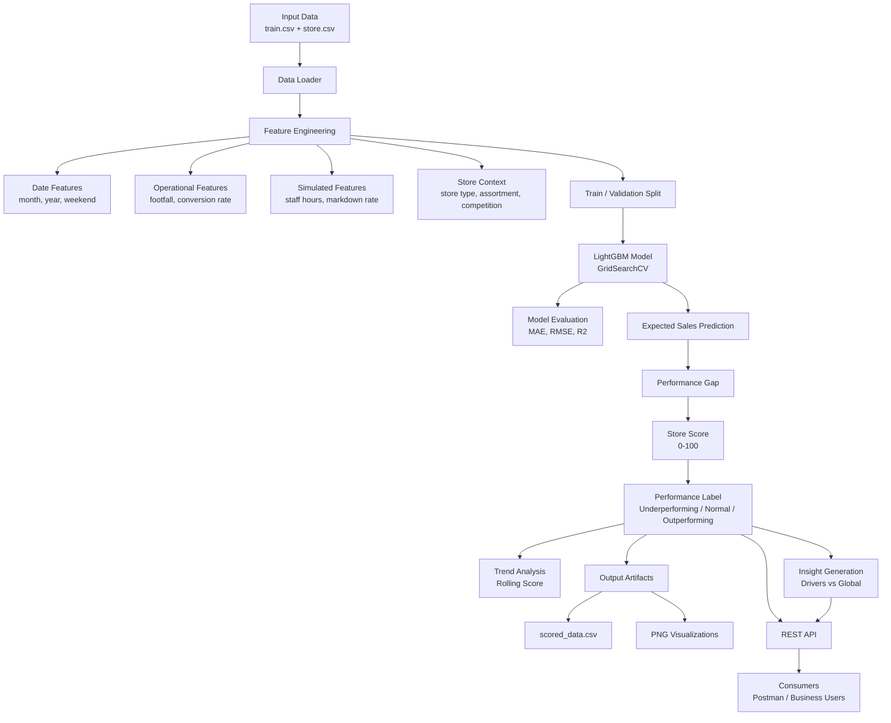

# Store Performance Scoring System

This project is an end-to-end machine learning solution for evaluating retail store performance in a fair and context-aware way.

Instead of comparing stores using raw KPIs only, the system estimates each store’s expected performance based on its business context and then scores stores according to how much they overperform or underperform against that expectation.

---

## Architecture Diagram



---

## Project Goals

The goal is to identify stores that are:

- Consistently outperforming expectations
- Consistently underperforming expectations
- Showing recent deterioration that may require intervention

The system demonstrates:

- Machine learning and statistical thinking  
- Engineering maturity  
- Business impact and interpretability  

---

## Dataset

The project uses the Rossmann Store Sales dataset.

### Main Files

| File | Description |
|------|------------|
| train.csv | Daily store-level sales data |
| store.csv | Store metadata and contextual attributes |

### Key Fields

| Column | Description |
|--------|------------|
| Store | Store identifier |
| Date | Observation date |
| Sales | Target variable |
| Customers | Number of customers |
| Promo | Promotion indicator |
| SchoolHoliday | Holiday flag |
| StoreType | Store category |
| Assortment | Product assortment |
| CompetitionDistance | Distance to nearest competitor |

---

## Feature Engineering

Additional features are created to simulate real retail conditions:

| Feature | Description |
|--------|------------|
| month | Extracted from date |
| year | Extracted from date |
| is_weekend | Weekend indicator |
| footfall | Simulated store traffic |
| conversion_rate | Customers / footfall |
| staff_hours | Simulated staffing |
| markdown_rate | Promotion-based proxy |

Some features are simulated to reflect real operational signals not present in the dataset.

---

## Modeling Approach

The model estimates expected sales using contextual and operational features.

- Model: **LightGBM Regressor**
- Hyperparameter tuning: **GridSearchCV**
- Metrics:
  - MAE
  - RMSE
  - R²

The model is used as a baseline estimator, not only as a forecasting tool.

---

## Scoring Logic

```
performance_gap = actual_sales - expected_sales
relative_gap = performance_gap / expected_sales
score = 50 + (relative_gap * 100)
```

Score is clipped between 0 and 100.

### Score Interpretation

| Score Range | Label |
|------------|------|
| > 60 | Outperforming |
| 40–60 | Normal |
| < 40 | Underperforming |

---

## Trend Analysis

A rolling score is computed per store:

```
rolling_score = 7-day rolling average
```

This enables detection of:

- Persistent underperformance  
- Performance deterioration  
- Temporary fluctuations  

---

## Driver Analysis

Stores are compared against global averages for key metrics:

- conversion_rate  
- footfall  
- staff_hours  
- markdown_rate  

Example output:

```
Lower conversion_rate vs global (-0.007)
Lower footfall vs global (-160.098)
Higher markdown_rate vs global (+0.002)
```

This enables root-cause analysis instead of simple flagging.

---

## Generated Outputs

All outputs are saved to:

```
outputs/
```

Files include:

```
scored_data.csv
score_distribution.png
label_distribution.png
expected_vs_actual.png
store_<id>_trend.png
store_<id>_comparison.png
```

---

## REST API

Base URL:

```
http://localhost:1001
```

### Health Check

```
GET /health
```

---

### Store Summary

```
GET /store/{store_id}
```

Response:

```json
{
  "store_id": 425,
  "avg_score": 14.25,
  "performance_label": "underperforming",
  "avg_sales": 4800.21,
  "avg_expected_sales": 6100.87,
  "latest_trend": 38.14
}
```

---

### Store Drivers

```
GET /store/{store_id}/drivers
```

---

### Top Stores

```
GET /top-stores?limit=10
```

---

### Worst Stores

```
GET /worst-stores?limit=10
```

---

### Score Prediction

```
POST /score
```

Request:

```json
{
  "DayOfWeek": 3,
  "Promo": 1,
  "SchoolHoliday": 0,
  "StoreType": 1,
  "Assortment": 2,
  "CompetitionDistance": 500,
  "month": 6,
  "year": 2015,
  "is_weekend": 0,
  "footfall": 300,
  "conversion_rate": 0.8,
  "staff_hours": 12,
  "markdown_rate": 0.2
}
```

Response:

```json
{
  "expected_sales": 8423.12
}
```

---

## Project Structure

```
rossman_case/
│
├── data/
├── outputs/
├── src/
│   └── main.py
├── api/
├── core/
├── utils/
├── Dockerfile
├── docker-compose.yml
├── entrypoint.sh
├── requirements.txt
├── config.ini
└── README.md
```

---

## How to Run

### 1. Create output directory

```
mkdir -p outputs
```

### 2. Start the service

```
docker compose up --build
```

### 3. Access API

```
http://localhost:1001
```

---

## Docker Configuration

```
version: "3.8"

services:
  rossman-api:
    build: .
    ports:
      - "1001:1001"
    volumes:
      - ./outputs:/code/outputs
    environment:
      - PYTHONPATH=/code
```

---

## Configuration

`config.ini`

```
[Service]
host = 0.0.0.0
port = 1001
debug = True
```

---

## Business Value

This system enables:

- Fair comparison of stores under different conditions  
- Early detection of underperformance  
- Root cause identification  
- Data-driven intervention planning  

---

## Limitations

- Some features are simulated  
- No real hierarchical modeling (region/country)  
- Model is trained at runtime for demonstration purposes  

---

## Future Improvements

- SHAP explainability  
- Hierarchical modeling  
- Model persistence (MLflow)  
- Authentication  
- Swagger documentation  
- Dashboard integration  

---

## Author

Eser İnan Arslan  
Senior Data Scientist / Machine Learning Engineer